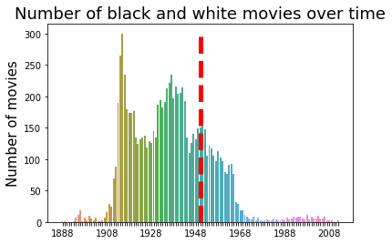
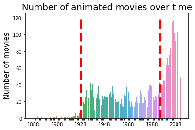

<!---Introduction part, with Gif and main question posted-->

The first film ever made ---- "horse in motion" ---- was a 6-second black-and-white slient clip of a trotting horse. Today, films are usually feature-length with computer-generated images and complex sound effects over a wide range of topics.

André Aciman once said: "Film is a mirror of reality and it is a filter". Here, together, we will look at films through through the perspective of data science and answer the question: 

 

# **How does technology and historical events influence film development?**
### To answer this question, we examined the metadata of 81741 films recorded in Freebase with fields like runtime, revenue, language, release time, and genre. For 42306 of them, we also studied their plots taken from wikipedia. Let's first have an overview of the films included: 



<!-- TODO: some other aspects of the film other than this graph.  -->

<!-- TODO: Plot either 2 subplots of the total number of films, or plot film length over time to illustrate the idea of "feature-length" -->
<!-- Want to show the following things: 
1. silent film 
2. color film 
3. length of the film 
Three things influenced mostly by technology -->

## **From the metadata perspective, we found 4 big changes in the film industry:**

### 1. The invention of Eastman Kodak color film in the 1950s broke the color film monopoly and lead to a decrease in black and white films after 1960s. 
<!-- TODO: CITATION Needed   -->

   

### 2. The first sound movie _The Jazz Singer_ was premiered on October 6, 1927. Immediately after, the popularity of silent films dropped. 

    

### 3. In 1928, the first Disney Micky Mouse animation with synchronizezd sound was released and led to immediate success, thus opening the chapter for animated films. In 1995, the first digitally made animation _Toy Story_  was released by Pixar, leading to the 2nd increase of animated movies. 

 

### 4. Nowadays, we are used to the idea of going to see "one movie". But did you know that many short films used to be presented together in theatres? Since 1888, average runtime has increased, and stablized around 100 minutes.Thus the term "feature-length", which refered to the promoted one.  As Hitchcock said "The length of a film should be directly related to the endurance of the human bladder". 

   

## Plots reveal the impact of historical events on film topics.
<!-- TODO: a bit of methodology  -->

- doc2vec model, how you choose the events, 
- table of the regression 
1. Similarity btwen events and plots summary, we present the significant 
- apollo
- 
2. deduce which one event out of the 25 events has the most impact

1. 

## Perception of historical events
 - overall historical sentiment 
 - look at 25 events
 - Russian