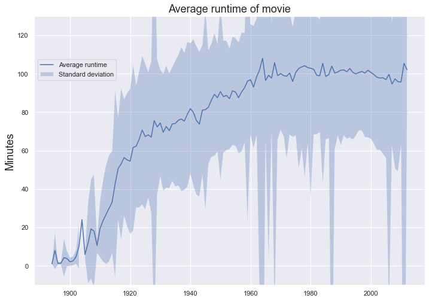
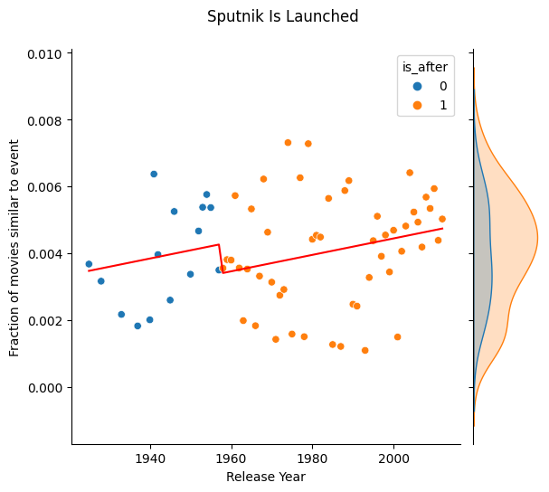
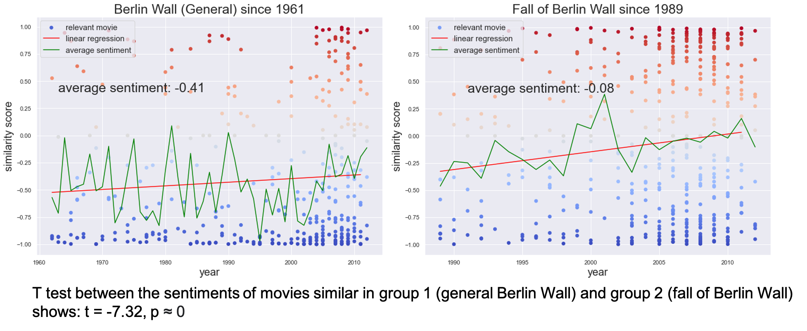
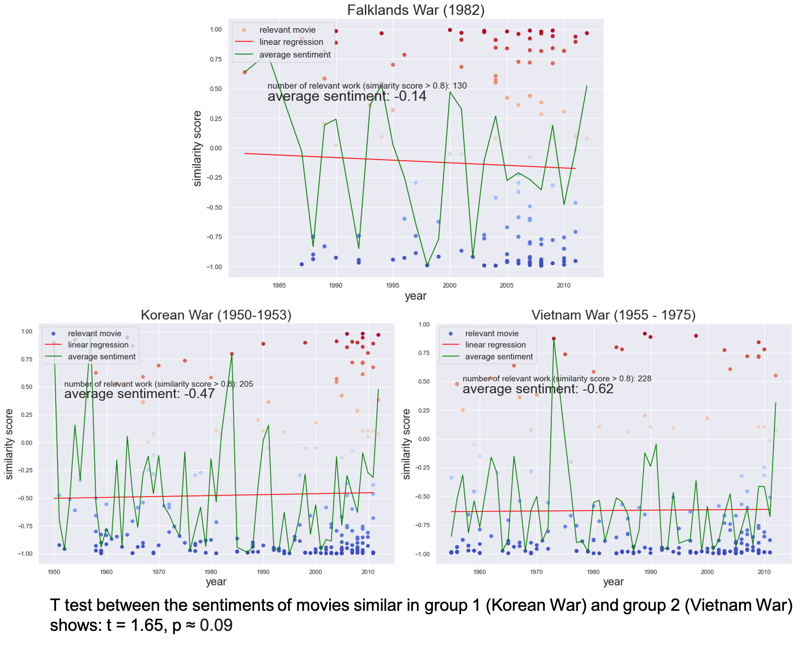

<!---Introduction part, with Gif and main question posted-->

The first film ever made ---- "horse in motion" ---- was a 6-second black-and-white slient clip of a trotting horse. Today, films are usually feature-length with computer-generated images and complex sound effects over a wide range of topics.

André Aciman once said: "Film is a mirror of reality and it is a filter". Here, together, we will look at films through the perspective of data science and answer the question: 

 

# **How does technology and historical events influence film development?**
### To answer this question, we examined the metadata of 81741 films recorded in Freebase with fields like runtime, revenue, language, release time, and genre. For 42306 of them, we also studied their plots taken from wikipedia. Let's first have an overview of the films included: 



## **From the metadata perspective, we found 4 big changes in the film industry:**

### 1. The invention of <a href="https://en.wikipedia.org/wiki/Color_motion_picture_film">Eastman Kodak color film </a> in the 1950s broke the color film monopoly and lead to a decrease in black and white films after 1960s. 
<!-- TODO: CITATION Needed   -->

   

### 2. The first sound movie <a href="https://en.wikipedia.org/wiki/The_Jazz_Singer">_The Jazz Singer_</a> was premiered on October 6, 1927. Immediately after, the popularity of silent films dropped. 

    

### 3. In 1928, the first Disney <a href="https://en.wikipedia.org/wiki/Mickey_Mouse"> Micky Mouse </a> animation with synchronized sound was released and led to immediate success, thus opening the chapter for animated films. In 1995, the first digitally made animation <a href="https://en.wikipedia.org/wiki/Toy_Story">_Toy Story_ </a> was released by Pixar, leading to the 2nd increase of animated movies. 

 

### 4. Nowadays, we are used to the idea of going to see "one movie". But did you know that many short films used to be presented together in theatres? Since 1888, average runtime has increased, and stablized around 100 minutes.Thus the term "feature-length", which refered to the promoted one.  As Hitchcock said "The length of a film should be directly related to the endurance of the human bladder". 

## **From the perspective of plots, what can we learn about the impact of historical events on film?**

### In order to understand the impact of historical events on movies, we first need to find out __what movies are relevant to which event?__ To do this, we compare the wikipedia summary of an event with all the movie plots and calculate a similarity score for each pair. To increase the effectiveness of the model we use the following preprocessing techniques: stopwords removal, lemmatization, and removal of frequently occuring words in the corpus.

### With the above method, we define a pair of similarity score > 0.8 as _similar_ or _relevant_ to an event. To see the impact of historical events on movies, we ask the following question: **Is the fraction of similar movies larger in the dataset after than before the event?**

### How can we examine this? Regression! We'll use the **fraction of similar movies per year** (_F_) as response variable while **year** (_Y_) and an indicator variable **is after** (_A_ ) will be used as covaraiates. This yields the formula:

### where __α__ is a constant and __ε__ is random noise. So why do we use the fraction of similar movies per year rather to the, perhaps more intuitive quanity, _similar movies per year_? We saw earlier that the number of movies produced each year has increased over time. This means we have to work with fractions instead of absolute quantities to compensate this effect. The results from these regression models are found in the table below.

| **Event**                                         | &alpha; | &beta;1              | &beta;2            | **Significant coefficients\***                   |
|---------------------------------------------------|---------|---------------------------------|-------------------------------|------------------------------------------------|
| Pearl Harbour                                     | 0.1986  | -0.0001                         | 0.0078                        | &alpha;, &beta;1, &beta;2 |
| Apollo 11                                         | -0.2270 | 0.0001                          | -0.0034                       | &alpha;, &beta;1, &beta;2 |
| John Hinckley Jr Attempts To Assassinate Reagan   | -0.0524 | 2.886&middot;10-5    | 0.0027                        | &beta;2                             |
| Cold War                                          | -0.1623 | 8.567&middot;10-5    | -0.0005                       | &alpha;, &beta;1                   |
| Brown v. Board of Education of Topeka             | -0.0040 | 4.096&middot;10 -6   | -0.0015                       | &beta;2                             |
| The Berlin Wall Falls                             | 0.0146  | -5.343&middot;10-6   | 0.0026                        | &beta;2                             |
| The Hungarian Revolution Starts                   | 0.0626  | -2.991&middot;10-5   | 0.0030                        | &beta;2                             |
| The War In The Falkland Islands Begins            | -0.0870 | 4.75&middot;10-5     | -0.0011                       | &alpha;, &beta;1                   |
| The Iranian Revolution Happens                    | -0.1286 | 6.846&middot;10-5    | 0.0001                        | &alpha;, &beta;1                   |
| Apartheid Ends                                    | -0.0773 | 4.133&middot;10-5    | 0.0012                        | None                                           |
| Nelson Mandela Is Released From Prison            | -0.0264 | 1.554&middot;10-5    | 0.0006                        | None                                           |
| Stanislav Petrov Saves The World By Doing Nothing | -0.0799 | 4.333&middot;10-5    | -0.0005                       | None                                           |
| Apollo 13                                         | -0.1088 | 5.895&middot;10 -5   | -0.0015                       | None                                           |
| Winston Churchill Dies                            | 0.0034  | 2.146&middot;10 -7   | -0.0009                       | None                                           |
| Civil Rights Act Is Passed                        | -0.0252 | 1.479&middot;10-5    | -0.0007                       | None                                           |
| President Kennedy Is Assassinated                 | -0.0751 | 4.145&middot;10-5    | 0.0011                        | None                                           |
| Construction Begins On The Berlin Wall            | -0.0436 | 2.543&middot;10-5    | -0.0019                       | None                                           |
| The Vietnam War begins                            | -0.0630 | 3.571&middot;10-5    | -0.0014                       | None                                           |
| China Begins The Great Leap Forward               | -0.0392 | 2.21&middot;10-5     | 0.0002                        | None                                           |
| Sputnik 2 Is Launched                             | -0.0439 | 2.462&middot;10-5    | -0.0009                       | None                                           |
| The Warsaw Pact Is Signed                         | -0.0492 | 2.764&middot;10-5    | 0.0012                        | None                                           |
| The Korean War                                    | -0.0432 | 2.457&middot;10-5    | 0.0018                        | None                                           |
| The Marshall Plan Is Implemented                  | -0.0460 | 2.582&middot;10-5    | -0.0013                       | None                                           |
| The Truman Doctrine Is Announced                  | -0.0505 | 2.875&middot;10-5    | -0.0016                       | None                                           |
| Atomic Bombing Of Hiroshima And Nagasaki          | -0.0388 | 2.244&middot;10-5    | 0.0009                        | None                                           |

\* Significance level: _p_ < 0.05

### We know, this is a lot of numbers to digest... But we can start with investigating the events which has three statistically significant coefficients, Pearl Harbour and Apollo 11.

### These two plots look about as different as two plots can look in this context. It seems like movies similar to the Pearl Harbour event where becoming less frequent before the event, then Pearl Harbour Attack happened, which resulted in more movies similar to Pearl Harbour. On the contrary, the Apollo 11 event seems to have made directors less inspired to make space or adventure related movies. The coefficient, &beta;2 is negative and it can clearly be seen in the plot. At the same time, the fraction of Apollo 11 movies is increasing with time. 

## 4 Key Take-Aways from this regression analysis

*   ### **The fraction of war films is increasing**. In this list of important world event, there is (unfortunately) a lot of wars. What all of them have in common is a positive &beta;1 coefficient which indicates that the fraction of movies similar to the event is increasing with time. Two examples are shown below.

### Despite the fact that most of the &beta;2-coefficients for war-related events aren't significant, it is still worth to mention that most of them point in the same direction. Immidiately after a war, there seems to be a decline in the production of these movies. This might be because the audience might be less receptive to war-related movies when it's close by.  <!-- How do I tab this paragraph to align with list?--> 

*   ### **Berlin Wall Contruction vs Demolition**. The opinion on the construction of a Berlin Wall was unanimous. It was terrible news, at least for East Berlin inhabitants. The demolition of the wall however, is remembered as one of the greatest parties in human history. Can we spot this in the data? 

### We see that movies similar to the construction of the wall saw a decrease immidiately after the event occured. While we see a sharp increase in movies which are similar to the demolition of the wall directly after the event. The misery of a Berlin Wall was not something movie producers wanted to feed to the contemporary audience. The demolition of the wall might have released a sense of new beginning and freedom which were keywords that movie producers embraced. Yet, the fraction of similar movies to the construction appears to increase with time while it decreases with time (or remains unchanged) for demolition-alike movies. Dark themes in movies might be more resitant to time after all. <!-- How do I tab this paragraph to align with list?--> 

*   ### **(Attempted) Assasinations of American Presidents are always popular**. This very controversial initial sentence certainly needs an explanation. Among the real-world events included in this analysis we find the assasination of President John F. Kennedy and the attempted assasination of President Ronald Reagan. The regression models for these two events have the same shape, the fraction of similar movies to these events are always increasing, that is &beta;1 and &beta;2 are positive.

### This might have something to do with the intensity of the event. What separates these events from for example wars are that an assasination happens in one day, while a war can be long, protracted and slow. There might something with the intensity of the event, that everything happens at the same time, that makes it irresitable for movie producers to not write something about it. <!-- How do I tab this paragraph to align with list?--> 

*   ### **Space events don't live up to the hype**. The event dataset contains three space-related events, The Apollo 11 and 13 missions and the launch of Sputnik 2. The pattern we see among these events are that there is a clear upward trend over time but they all have a negative &beta;2-coefficient. The fraction of similar movies decreases immidiately after the event. In a long-term perspective however, space-related movies appears to increase in popularity.

## When is the peak of movies after an influential event?
### Now we ask ourselves how *long* does it take for an event to reach its peak influence of the movie industry. We therefore define *latency* to be the first year after the event where the similarity fraction of that year is greater than the largest year before the event. The latency is not defined if no such year exist. Latency should serve as a simple and interpretable metric for defining time to peak influence. 

### We find that the latency is defined for 16 out of 23 events (see table below). The average latency is 16.2 years and the median 16 years. Although it's difficult to know for sure since we have limited data, but it looks like the results can be charactericed by two distinct groups. The first where the movie industry is quickly influenced by the event (the first events with latencies between 1-4 years), and the second where it ranges from 13-44 years.

|                                                            |   latency |
|:-----------------------------------------------------------|----------:|
| Pearl Harbor                                               |         1 |
| Atomic Bombing Of Hiroshima And Nagasaki                   |         2 |
| The Truman Doctrine Is Announced                           |         2 |
| The Marshall Plan Is Implemented To Assist Post-War Europe |         3 |
| The Korean War                                             |         4 |
| Brown v. Board of Education of Topeka                      |         4 |
| The Warsaw Pact Is Signed                                  |        13 |
| Sputnik Is Launched                                        |        16 |
| China Begins The Great Leap Forward                        |        16 |
| President Kennedy Is Assassinated                          |        16 |
| Civil Rights Act Is Passed                                 |        16 |
| Apollo 13                                                  |        17 |
| The Iranian Revolution Happens                             |        22 |
| John Hinckley Jr Attempts To Assassinate Reagan            |        23 |
| The War In The Falkland Islands Begins                     |        25 |
| The Berlin Wall Falls                                      |        28 |
| Nelson Mandela Is Released From Prison                     |        40 |
| Apartheid Ends                                             |        44 |

## **How are historical events and concepts perceived through movies ?**

### Our perceptions of past events change as time goes on. By doing a sentiment analysis on the plots of movies about these events, we can see how events and concepts are viewed differently over time through the lens of film. Here, we can see that globally movie plots have been generally negative, and becoming slightly more negative over time. 

### Here we present 3 examples to show how events are viewed differently over time. 

### 1. We select movie plots most similar (similarity score > 0.8) to the wikipedia article of <a href="https://en.wikipedia.org/wiki/Berlin_Wall">the Berlin Wall</a> (general, which focuses on its construction) and <a href="https://en.wikipedia.org/wiki/Fall_of_the_Berlin_Wall">the Fall of Berlin Wall</a>, we see that the two events are perceived differently. Although both events are perceived as negative, _the Fall Of Berlin Wall_ has a more positive sentiment score and a faster increasing slope. This corresponds to the more postive perception of Berlin Wall's Fall and the end of the Cold War.

### 2. We compare the sentiments towards two wars with many similar characteristics. Both the <a href="https://en.wikipedia.org/wiki/Korean_War">Korean War</a> and the <a href="https://en.wikipedia.org/wiki/Vietnam_War">Vietnam War</a> started in the 1950s, with the United States combatting overseas in Asia against communist forces. Both wars ended with unsatisfactory results from the U.S. perspective. The Korean War ended with an armistice, and the Vietnam war ended with a U.S. defeat. It's reasonable that the two wars exhibit similar negative sentiments (-0.47 and -0.62). This particularly obvious when compared to the Falklands War between Argentina and the U.K. in the 1980s, which also had <a href="https://en.wikipedia.org/wiki/Cultural_impact_of_the_Falklands_War">a cultural impact. </a> 

### However, our sentiment analysis is not particularly robust. The above example of Apollo 11 and Apollo 13 demonstrates the weaknesses of our analysis. As successful space missions that landed humans on the moon, Apollo missions should be perceived generally positively, or at least neutral. However, in the above analysis, both events have negative sentiments. In addition, Apollo 11 is the first mission that landed humans on the moon, while Apollo 13 is unsuccessful due to oxygen tank malfunction, so we expect the sentiments towards these events to be different, yet they have the exact same average sentiment.

### Specifically, the weaknesses come down to two points:   
### 1. **Our method cannot exclude the interfering effects between two events.** In the case above, a space movie will have high similarity score for both topic "Apollo 11" and "Apollo 13". We tried to stopwords removal and lemmatization to reduce the number of features, yet the model cannot distinguish the events at a nuanced level. 

### 2. **The sentiment of the plots do not always reflect the perception of the events.** A movie needs hardships and challenges to make the story interesting. This, however, doesn't represent the overall perception of the event. A happy ending, summarized with a few sentences, will weigh less than the rest of the story. Many events, such as the Apollo missions, might be positive in nature, will be represented as negative. 

## **Conclusion** 

### To conclude the question of how technology and historical events have affected the film industry, we have investigated three aspects in depth: how the movie metadata has changed throughout time, how historical events have impacted films and how historical events and concepts are differently perceived through history.

### For metadata investigation, we found that the invention of movies with sound and color decreased the popularity of its predecessor, silent and black-and-white film. Likewise, the first synchronized sound and animation film, as well as the first digitally created animation film, led to two significant increases in animated movie popularity. The average runtime movie has also increased and stabilized by around 100 minutes because of the shift from seeing many short films in one watch to only seeing one long movie. 

### Different historical events have affected the sequential movie industry. Using regression analysis, it was discovered that two events had significance in all three regression coefficients: Apollo 13 and Pearl Harbor. While the attack of Pearl Harbor led to an initial increase in similar movies, the Apollo 13 mission, as well as Apollo 11, decreased the popularity of space-like movies. Furthermore, war movies show a slight decrease in popularity, followed by an increase over time after wars like the Vietnam War, the Cold war, and the Falkland Islands War. Movies similar to the Construction of the Berlin wall follow a similar trend pattern. On the contrary, the Fall of The Berlin Wall only resulted in a momentary rise in popularity immediately after the event. Lastly, assassination events, like the ones with President Kennedy and Regan, led to a noticeable increase in movies with similar plots after those events. The increase is likely due to the intensity of the events.

### We found 16 out of 23 events to have a defined popularity latency where the average is 16.2 years and the median is 16 years.

### For sentiment analysis, movies generally are becoming more negative over time. Both the Construction and the Fall of the Berlin Wall have been portrayed negatively in movies, the first more than the other. However, the Fall had a much higher increase in sentiment score over time, corresponding to the event's positive outcome. Furthermore, wars with similar characteristics, the Korean War and the Vietnam War, where the U.S. lost, have been portrayed as negative.
