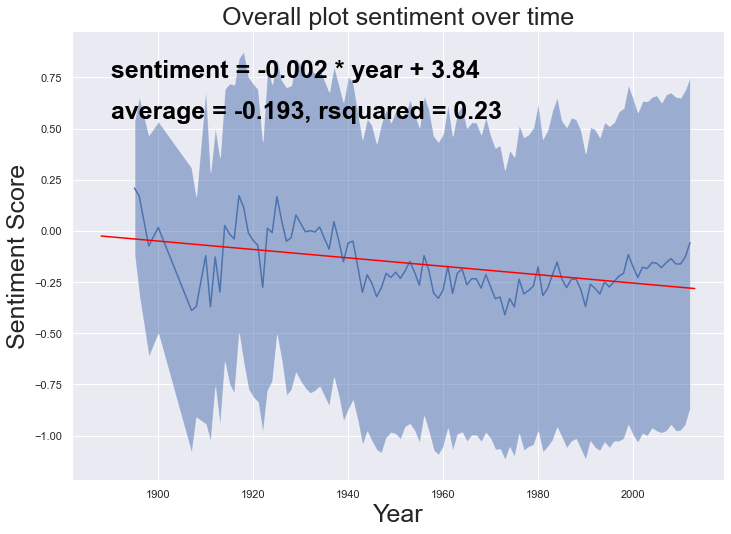

<!---Introduction part, with Gif and main question posted-->

The first film ever made ---- "horse in motion" ---- was a 6-second black-and-white slient clip of a trotting horse. Today, films are usually feature-length with computer-generated images and complex sound effects over a wide range of topics.

André Aciman once said: "Film is a mirror of reality and it is a filter". Here, together, we will look at films through through the perspective of data science and answer the question: 

 

# **How does technology and historical events influence film development?**
### To answer this question, we examined the metadata of 81741 films recorded in Freebase with fields like runtime, revenue, language, release time, and genre. For 42306 of them, we also studied their plots taken from wikipedia. Let's first have an overview of the films included: 



<!-- TODO: some other aspects of the film other than this graph.  -->

<!-- TODO: Plot either 2 subplots of the total number of films, or plot film length over time to illustrate the idea of "feature-length" -->
<!-- Want to show the following things: 
1. silent film 
2. color film 
3. length of the film 
Three things influenced mostly by technology -->

## **From the metadata perspective, we found 4 big changes in the film industry:**

### 1. The invention of Eastman Kodak color film in the 1950s broke the color film monopoly and lead to a decrease in black and white films after 1960s. 
<!-- TODO: CITATION Needed   -->

   

### 2. The first sound movie _The Jazz Singer_ was premiered on October 6, 1927. Immediately after, the popularity of silent films dropped. 

    

### 3. In 1928, the first Disney Micky Mouse animation with synchronizezd sound was released and led to immediate success, thus opening the chapter for animated films. In 1995, the first digitally made animation _Toy Story_  was released by Pixar, leading to the 2nd increase of animated movies. 

 

### 4. Nowadays, we are used to the idea of going to see "one movie". But did you know that many short films used to be presented together in theatres? Since 1888, average runtime has increased, and stablized around 100 minutes.Thus the term "feature-length", which refered to the promoted one.  As Hitchcock said "The length of a film should be directly related to the endurance of the human bladder". 

   

## **Historical Events, Similarity and Latency**
<!-- TODO: a bit of methodology  -->
Part 1: 
1. doc2vec model
2. explain how we got the events, and event summary
3. explain lemma and stop words 

Part 2: 
- table of the regression, t test for an overview 
- hand pick a few events, both good and bad 
- show the latency graph, and justify to the best extent

Since we seen that most events have an impact on the movie industry, a natural follow-up question is how *long* does it take for 
an event to reach its peak influence of the movie industry. We therefore define *latency* by the first year after the event where the 
similarity fraction of that year is greater than the largest year before the event. The latency is not defined if no such year exist.
Latency should serve as a simple and interpretable metric for defining time to peak influence. 

We find that the latency is defined for 18 out of 23 events. The average latency is 9.5 years and the median 9 years. We interestingly 
see two cluster: the first including 7 movies that ranges with a 1-6 year latency, and the second including 8 movies that ranges with a 
12-16 year latency. Moreover, the events *The Civil Rights Act* and *The Cold War Begins* have latencies well above all other with 43 and 
60 years, respectively (these were removed from the average and median calculation). Although it's difficult to know for sure since we
have limited data, it could be the case that some events take hold and creates an up-swing of movies several decades later.

## **How are historical events and concepts perceived through movies ?**

### Our perceptions of past events change as time goes on. By doing a sentiment analysis on the plots of movies about these events, we can see how events and concepts are viewed differently over time through the lens of film. Here, we can see that globally movie plots have been generally negative, and becoming slightly more negative over time. 

### Here we present 3 examples to show how events are viewed differently over time. 

### 1. We select movie plots most similar (similarity score > 0.8) to the wikipedia article of <a href="https://en.wikipedia.org/wiki/Berlin_Wall">the Berlin Wall</a> (general, which focuses on its construction) and <a href="https://en.wikipedia.org/wiki/Fall_of_the_Berlin_Wall">the Fall of Berlin Wall</a>, we see that the two events are perceived differently. Although both events are perceived as negative, _the Fall Of Berlin Wall_ has a more positive sentiment score and a faster increasing slope. This corresponds to the more postive perception of Berlin Wall's Fall and the end of the Cold War.

### 2. We compare the sentiments towards two wars with many similar characteristics. Both the <a href="https://en.wikipedia.org/wiki/Korean_War">Korean War</a> and the <a href="https://en.wikipedia.org/wiki/Vietnam_War">Vietnam War</a> started in the 1950s, with the United States combatting overseas in Asia against communist forces. Both wars ended with unsatisfactory results from the U.S. perspective. The Korean War ended with an armistice, and the Vietnam war ended with a U.S. defeat. It's reasonable that the two wars exhibit similar negative sentiments (-0.47 and -0.62). This particularly obvious when compared to the Falklands War between Argentina and the U.K. in the 1980s, which also had <a href="https://en.wikipedia.org/wiki/Cultural_impact_of_the_Falklands_War">a cultural impact. </a> 

### However, our sentiment analysis is not particularly robust. The above example of Apollo 11 and Apollo 13 demonstrates the weaknesses of our analysis. As successful space missions that landed humans on the moon, Apollo missions should be perceived generally positively, or at least neutral. However, in the above analysis, both events have negative sentiments. In addition, Apollo 11 is the first mission that landed humans on the moon, while Apollo 13 is unsuccessful due to oxygen tank malfunction, so we expect the sentiments towards these events to be different, yet they have the exact same average sentiment.

### Specifically, the weaknesses come down to two points:   
### 1. Our method cannot exclude the interfering effects between two events. In the case above, a space movie will have high similarity score for both topic "Apollo 11" and "Apollo 13". We tried to stopwords removal and lemmatization to reduce the number of features, yet the model cannot distinguish the events at a nuanced level. 

### 2. The sentiment of the plots do not always reflect the perception of the events. A movie needs hardships and challenges to make the story interesting. This, however, doesn't represent the overall perception of the event. A happy ending, summarized with a few sentences, will weigh less than the rest of the story. Many events, such as the Apollo missions, might be positive in nature, will be represented as negative. 

## **Conclusion** 
To be done