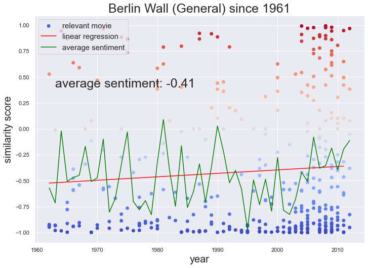
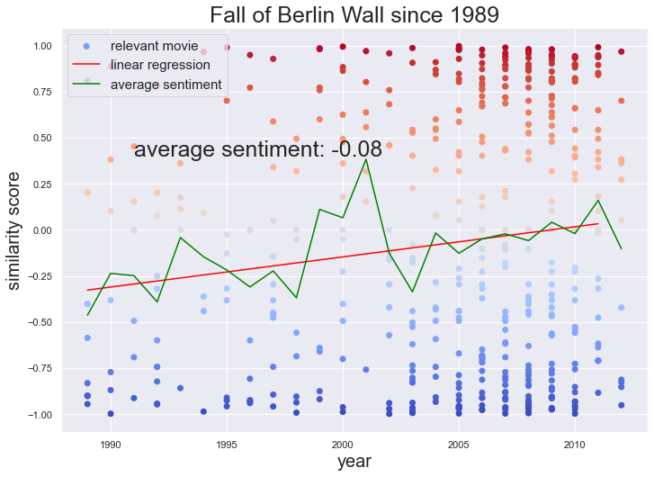

## **How are historical events and concepts perceived through movies ?**

### Our perceptions of past events change as time goes on. New research and reflections might shine light on events previously considered negative. By doing a sentiment analysis on the plots, we can see how events and concepts are viewed differently over time. Here, we can see that globally movie plots have been generally negative, and becoming slightly more negative over time. 

### A closer look at a historical events or key words reveal how their representations change in movies. 

### When we select movie plots most relevant to <a href="https://en.wikipedia.org/wiki/Berlin_Wall">Berlin Wall (General)</a> and <a href="https://en.wikipedia.org/wiki/Fall_of_the_Berlin_Wall">Fall of Berlin Wall</a>, we see a difference in the perception of the two events. Although both events are perceived more positively over time, _the Fall Of Berlin Wall_ has a more positive sentiment score and higher slope, corresponding to the more postive perception of the event. 

  

## berlin wall
## vietnam war 
## 
