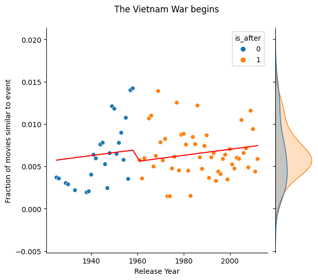
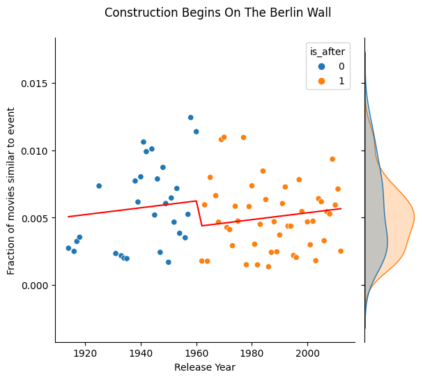
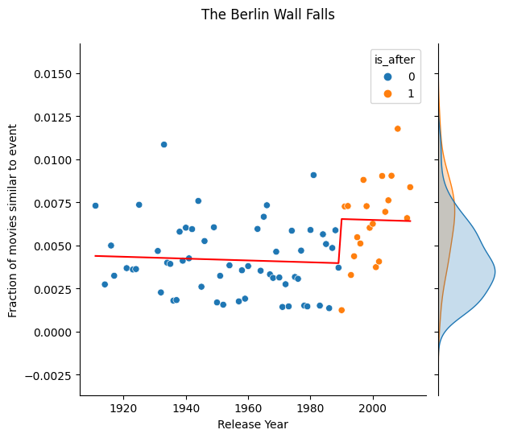
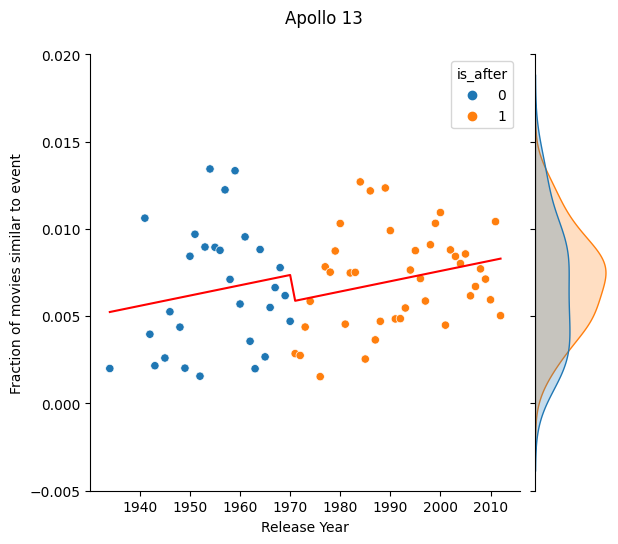

Please write here 

## Some good title here or not(?)

### Now let's look at each individual event. To determine if an event has had an impact on the movie industry, we'll again use the similarity score to classify a movie as _similar_ to an event. We'll quantify this be asking the question: Is the fraction of similar movies larger in the dataset after than before the event?

### How can we examine this? Regression! We'll use the the **fraction of similar movies per year** (_F_ ) as response variable and use **year** (_Y_ ) and an indicator variable **is after** (_A_ ) as covaraiates. This yields the formula:

### where alpha is a constant and epsilon is random noise. So why do we use the fraction of similar movies per year rather to the, perhaps more intuitive quanity, _similar movies per year_? We saw earlier that movie-making is much more popular today compared to earlier year. This means we have to work with fractions instead of absolute quantities to capture this effect. The results from these regression models are found in the table below.

| **Event**                                         | &alpha; | &beta;1              | &beta;2            | **Significant coefficients\***                   |
|---------------------------------------------------|---------|---------------------------------|-------------------------------|------------------------------------------------|
| Pearl Harbour                                     | 0.1986  | -0.0001                         | 0.0078                        | &alpha;, &beta;1, &beta;2 |
| Apollo 11                                         | -0.2270 | 0.0001                          | -0.0034                       | &alpha;, &beta;1, &beta;2 |
| John Hinckley Jr Attempts To Assassinate Reagan   | -0.0524 | 2.886&middot;10-5    | 0.0027                        | &beta;2                             |
| Cold War                                          | -0.1623 | 8.567&middot;10-5    | -0.0005                       | &alpha;, &beta;1                   |
| Brown v. Board of Education of Topeka             | -0.0040 | 4.096&middot;10 -6   | -0.0015                       | &beta;2                             |
| The Berlin Wall Falls                             | 0.0146  | -5.343&middot;10-6   | 0.0026                        | &beta;2                             |
| The Hungarian Revolution Starts                   | 0.0626  | -2.991&middot;10-5   | 0.0030                        | &beta;2                             |
| The War In The Falkland Islands Begins            | -0.0870 | 4.75&middot;10-5     | -0.0011                       | &alpha;, &beta;1                   |
| The Iranian Revolution Happens                    | -0.1286 | 6.846&middot;10-5    | 0.0001                        | &alpha;, &beta;1                   |
| Apartheid Ends                                    | -0.0773 | 4.133&middot;10-5    | 0.0012                        | None                                           |
| Nelson Mandela Is Released From Prison            | -0.0264 | 1.554&middot;10-5    | 0.0006                        | None                                           |
| Stanislav Petrov Saves The World By Doing Nothing | -0.0799 | 4.333&middot;10-5    | -0.0005                       | None                                           |
| Apollo 13                                         | -0.1088 | 5.895&middot;10 -5   | -0.0015                       | None                                           |
| Winston Churchill Dies                            | 0.0034  | 2.146&middot;10 -7   | -0.0009                       | None                                           |
| Civil Rights Act Is Passed                        | -0.0252 | 1.479&middot;10-5    | -0.0007                       | None                                           |
| President Kennedy Is Assassinated                 | -0.0751 | 4.145&middot;10-5    | 0.0011                        | None                                           |
| Construction Begins On The Berlin Wall            | -0.0436 | 2.543&middot;10-5    | -0.0019                       | None                                           |
| The Vietnam War begins                            | -0.0630 | 3.571&middot;10-5    | -0.0014                       | None                                           |
| China Begins The Great Leap Forward               | -0.0392 | 2.21&middot;10-5     | 0.0002                        | None                                           |
| Sputnik 2 Is Launched                             | -0.0439 | 2.462&middot;10-5    | -0.0009                       | None                                           |
| The Warsaw Pact Is Signed                         | -0.0492 | 2.764&middot;10-5    | 0.0012                        | None                                           |
| The Korean War                                    | -0.0432 | 2.457&middot;10-5    | 0.0018                        | None                                           |
| The Marshall Plan Is Implemented                  | -0.0460 | 2.582&middot;10-5    | -0.0013                       | None                                           |
| The Truman Doctrine Is Announced                  | -0.0505 | 2.875&middot;10-5    | -0.0016                       | None                                           |
| Atomic Bombing Of Hiroshima And Nagasaki          | -0.0388 | 2.244&middot;10-5    | 0.0009                        | None                                           |

\* Significance level: _p_ < 0.05

### We know, this is a lot of numbers to digest... But we can start with investigating the events which has three statistically significant coefficients, Pearl Harbour and Apollo 11.

### These two plots looks about as different as two plots can look in this context. It seems like movies similar to the Pearl Harbour event where becoming less frequent before the event, then Pearl Harbour happened and this resulted in a lot more movies similar to Pearl Harbour. On the contrary, the Apollo 11 event seems to have made directors less inspired to make space- or adventure related movies. The coefficient, &beta;2 is negative and it can clearly be seen in the plot. At the same time, the fraction of Apollo 11 movies is increasing with time. 

## 5 Key Take-Aways from this regression analysis

*   ### **The fraction of war films is increasing**. In this list of important world event, there is (unfortunately) a lot of wars. What all of them have in common is a positive &beta;1 coefficient which indicates that the fraction of movies similar to the event is increasing with time. Two examples are shown below.

### Despite the fact that most of the &beta;2-coefficients for war related event isn't significant, it is still worth to mention that most of them point in the same direction. Immidiately after a war, there seems to be a decline in the production of these movies. This might be because the audience might be less receptive to war-related movies when it's close by.  <!-- How do I tab this paragraph to align with list?--> 

*   ### **Berlin Wall Contruction vs Demolition**. The opinion on the construction of a Berlin Wall was unanimous. It was terrible news, at least for East Berlin inhabitants. The demolition of the wall however, is remembered as one of the greatest parties in human history. Can we spot this in the data? 

### We see that movies similar to the construction of the wall saw a decrease immidiately after the event occured. While we see a sharp increase in movies which are similar to the demolition of the wall directly after the event. The misery of a Berlin Wall was not something movie producers wanted to feed to the contemporary audience. The demolition of the wall might have released a sense of new beginning and freedom which were keywords that movie producers embraced. Yet, he fraction of similar movies to the construction appears to increase with time while it decreases with time (or remains unchanged) for demolitiom-alike movies. Dark themes in movies might be more resitant to time after all. <!-- How do I tab this paragraph to align with list?--> 

*   ### **(Attempted) Assasinations of American Presidents are always popular**. This very controversial initial sentence certainly needs an explanation. Among the real-world events included in this analysis we find the assasination of President John F. Kennedy and the attempted assasination of President Ronald Reagen. The regression models for these two events have the same shape, the fraction of similar movies to these events are always increasing, that is &beta;1 and &beta;2 are positive.

### This might have something to do with the intensity of the event. What separates these events from for example wars are that an assasination happens in one day, one second, while a war can be long, protracted and slow. There might something with the intensity of the event, that everything happens at the same time, that makes it irresitable for movie producers to not write something about it. <!-- How do I tab this paragraph to align with list?--> 

*   ### **Space events don't live up to the hype**. The event dataset contains three space-related events, The Apollo 11 and 13 missions and the launch of Sputnik 2. The pattern we see among these events are that there is a clear upward trend over time but they all have a negative &beta;2-coefficient. The fraction of similar movies decreases immidiately after the event.

### Write something more

*   ### **You know all those movies about political reforms?**. Write about Marshall Plan, Civil Rights Act, Board vs Brown

you can look at stylesample.md to see what you can do..

Your page will display at : 

http://localhost:4000/similarity